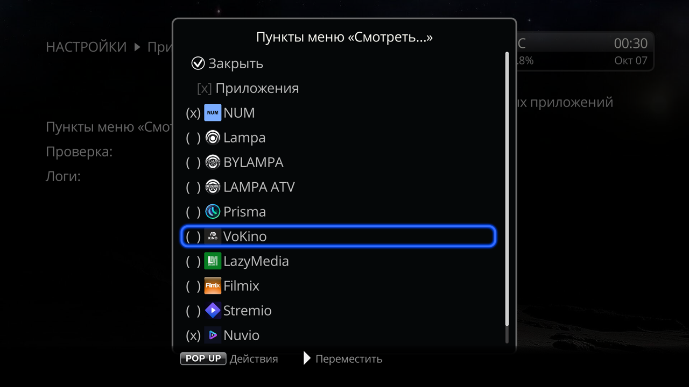

# Play in apps for Dune HD

[Русский](README.md) | **English**

A Dune HD plugin that adds items to the **Play...** menu of a movie or series card in the Dune **Movies** catalog. Each item opens the same title (or a search for it) in an Android TV app; the Filmix item opens it in the Filmix_API Dune plugin. Items appear only for installed apps; any of them can be hidden on the plugin screen, **Settings → Applications → Play in apps**.

 

| Menu item | Opens the title by |
|---|---|
| NUM | TMDB ID |
| Lampa | TMDB ID |
| Prisma | TMDB ID |
| VoKino | IMDb ID, else search by title |
| LazyMedia | no ID, search by title only |
| Filmix | no ID, search by title in the Filmix_API Dune plugin |
| Stremio | IMDb ID, else TMDB ID |
| Nuvio | IMDb ID, else TMDB ID |
| FreeZona | Kinopoisk ID |

Details on each item are in the [plugin README](plugin/play_in_apps/README.en.md). The apps themselves (for Filmix, the Filmix_API plugin) must be installed and set up (addons, accounts) separately.

Missing items and why:
- **Kino.pub (KinoWatch)**: the app opens a title only by its internal kino.pub number. It cannot be opened by IMDb, TMDB or title, and a search cannot be started from outside either, so the item could only open the app's home screen.
- **Lift**: the app opens a title only by its internal number, and a search cannot be started from outside, so the item could only open the app's home screen.
- **Lampa TV 7.7.9 (`ru.twicker.lampa`, the "Un" build)**: the card opens only if the link is sent again about a second after the app starts. That workaround is fragile (on a slow network you get the home screen instead), and the build is no longer updated. The Lampa item works with the official LAMPA (`top.rootu.lampa`).

Tested only on Dune HD Pro 8K Plus, firmware 260827_0003_r24. Other Android Dune models with r24 firmware may work, but this is not tested.

## Install
1. Download `dune_plugin_play_in_apps_<version>.zip` from [Releases](https://github.com/a1d4r/dune-hd-open-in/releases/latest).
2. Copy it to a USB drive or to the internal storage.
3. On the Dune open **Sources**, find the zip and press ENTER.
4. The items appear in the **Play...** menu within half a minute, no reboot needed.

Updates: since 0.3.0 the plugin supports online updates: after the Dune boots (waking from standby is not a boot) the firmware checks GitHub Pages for a new version and offers to install it. Install 0.3.0 itself by hand. If an update does not come, install the new zip over the old one, as before. To remove, uninstall the plugin in the Dune plugin list.

**If you have the separate "Open in …" plugins** (`num_supplier`, `nuvio_supplier` and others; until October 2026 each item was a plugin of its own), uninstall them in the Dune plugin list: this plugin replaces them, the items work the same way, and while an old plugin is installed its item cannot be hidden.

The plugin itself makes no network requests and runs nothing in the background. The Dune checks for its updates on GitHub Pages (`a1d4r.github.io`).

## Build from source
`sh build.sh play_in_apps` runs shellcheck and the tests, then writes `dist/dune_plugin_play_in_apps_<version>.zip`. Needs `shellcheck`, `dash`, `zip`, `python3` and `php` (`PHP=…` for another path); `mksh`, if installed, is used for a second test run. The Dune runs PHP 5.3.6: `tests/php53/Dockerfile` builds it along with all the tools, `docker build -t dune-php53 tests/php53`, then `docker run --rm -u "$(id -u):$(id -g)" -v "$PWD:/w" -w /w dune-php53 sh build.sh play_in_apps`. The zips in Releases are built by GitHub Actions with the same script in this image; CI runs the tests under both PHP 5.3.6 and Ubuntu's PHP.

## Feedback
Made for my own Dune and shared as is. Bug reports are welcome in [Issues](https://github.com/a1d4r/dune-hd-open-in/issues); fixes are best effort.

## License
MIT, see `LICENSE`.
