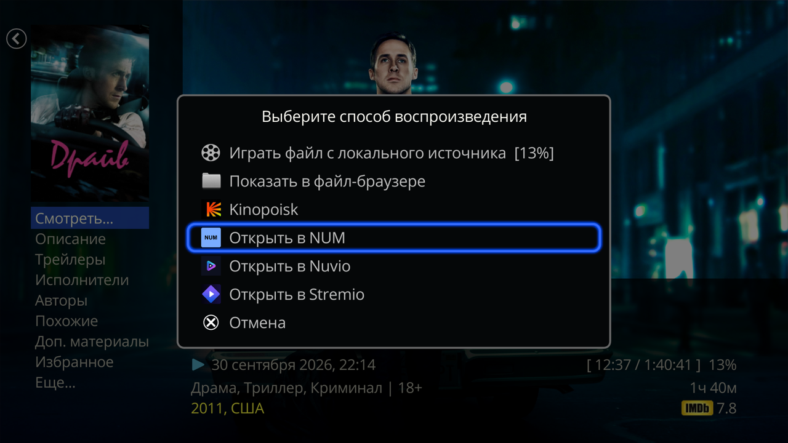

# «Смотреть в приложениях» для Dune HD

**Русский** | [English](README.en.md)

Плагин для Dune HD: добавляет пункты в меню **«Смотреть…»** карточки фильма или сериала в каталоге **«Фильмы»** Дюны. Каждый пункт открывает тот же фильм или сериал (или его поиск) в приложении для Android TV, а пункт Filmix — в плагине Дюны Filmix_API. Пункты появляются только для установленных приложений; любой можно скрыть на экране плагина **«Настройки» → «Приложения» → «Смотреть в приложениях»**.

| Пункт меню | По какому ID открывает |
|---|---|
| NUM | TMDB |
| Lampa | TMDB |
| Prisma | TMDB |
| VoKino | IMDb, если нет — поиск по названию |
| LazyMedia | не открывает по ID, только поиск по названию |
| Filmix | не открывает по ID, поиск по названию в плагине Дюны Filmix_API |
| Stremio | IMDb, если нет — TMDB |
| Nuvio | IMDb, если нет — TMDB |

Подробно о каждом пункте — в [README плагина](plugin/play_in_apps/README.md). Сами приложения (для Filmix — плагин Filmix_API) нужно установить и настроить (аддоны, аккаунты) отдельно.

Каких пунктов нет и почему:
- **Kino.pub (KinoWatch)** — приложение открывает фильм только по своему внутреннему номеру kino.pub. По IMDb, TMDB или названию его не открыть, поиск снаружи тоже не запустить: пункт мог бы только открыть главный экран приложения.
- **Lampa TV 7.7.9 (`ru.twicker.lampa`, сборка «Un»)** — карточка открывается, только если прислать ссылку повторно примерно через секунду после запуска приложения. Обход хрупкий (на медленной сети откроется главная), а сама сборка больше не обновляется. Пункт Lampa работает с официальной LAMPA (`top.rootu.lampa`).

Проверено только на Dune HD Pro 8K Plus, прошивка 260827_0003_r24. На других Android-моделях Дюны с прошивкой r24 может работать, но не проверялось.

## Установка
1. Скачайте `dune_plugin_play_in_apps_<версия>.zip` из [Releases](https://github.com/a1d4r/dune-hd-open-in/releases/latest).
2. Скопируйте его на флешку или во внутреннюю память.
3. На Дюне откройте **«Источники»**, найдите zip и нажмите ENTER.
4. Примерно через полминуты пункты появятся в меню **«Смотреть…»**, перезагрузка не нужна.

Обновление — новый zip поверх старого. Удаление — в списке плагинов Дюны.

**Если у вас стоят отдельные плагины «Открыть в …»** (`num_supplier`, `nuvio_supplier` и другие, до октября 2026 года каждый пункт был отдельным плагином) — удалите их в списке плагинов Дюны: этот плагин их заменяет, пункты работают так же, а пока стоит старый плагин, его пункт не скрыть.

Плагин не ходит в сеть и ничего не запускает в фоне.

## Сборка из исходников
`sh build.sh play_in_apps` прогоняет shellcheck и тесты и собирает `dist/dune_plugin_play_in_apps_<версия>.zip`. Нужны `shellcheck`, `dash`, `zip`, `python3` и `php` (`PHP=…` — другой путь); `mksh`, если установлен, используется для второго прогона тестов. На Дюне PHP 5.3.6 — его и все нужные инструменты собирает `tests/php53/Dockerfile`: `docker build -t dune-php53 tests/php53`, затем `docker run --rm -u "$(id -u):$(id -g)" -v "$PWD:/w" -w /w dune-php53 sh build.sh play_in_apps`. Zip в Releases собирает GitHub Actions тем же скриптом в этом образе; CI прогоняет тесты и под PHP 5.3.6, и под PHP из Ubuntu.

## Обратная связь
Сделано для своей Дюны и выложено как есть. Об ошибках пишите в [Issues](https://github.com/a1d4r/dune-hd-open-in/issues); исправления — по возможности.

## Лицензия
MIT, см. `LICENSE`.
